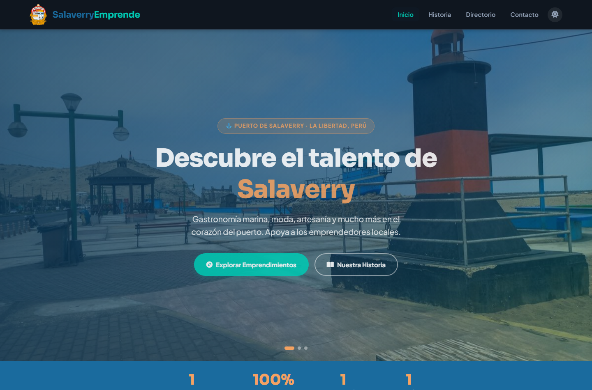
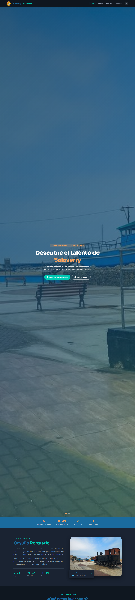
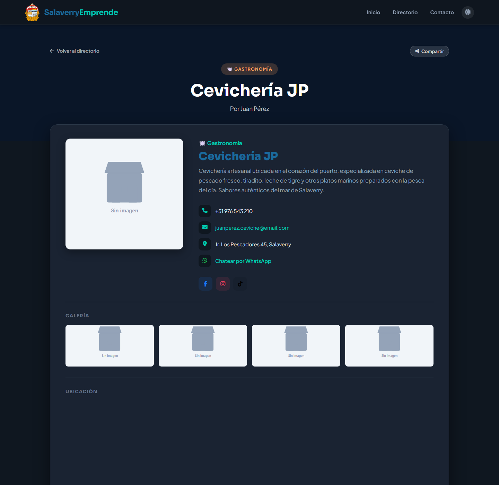
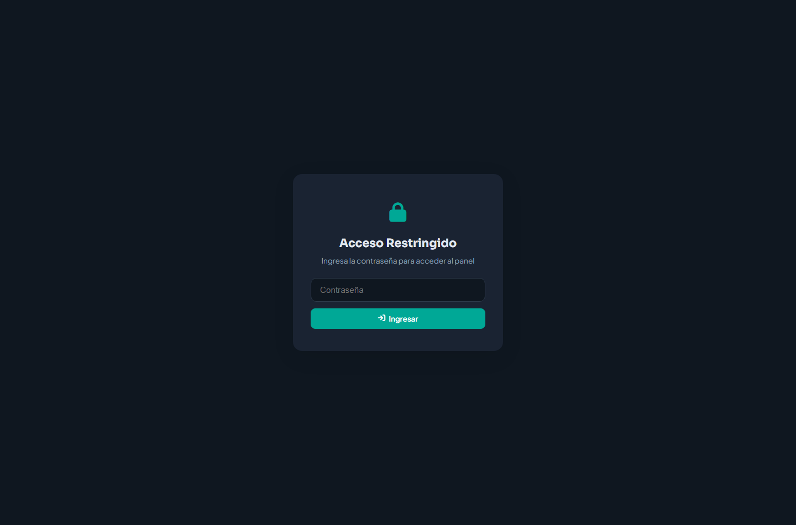

# Salaverry Emprende — Directorio de Emprendimientos del Puerto


**Salaverry Emprende** es el directorio web de emprendedores del Puerto de Salaverry (La Libertad, Perú), una iniciativa de la Municipalidad Distrital para promover el comercio local: catálogo público con búsqueda y filtros, perfiles individuales compartibles, panel de administración con CRUD completo y soporte PWA.

---

## 🧩 ¿Qué incluye?

```
Visitante → Sitio público → Panel admin → API PHP → emprendimientos.json
```

### Sitio público (`index.html`)

- Hero con slider automático de banners del puerto y estadísticas animadas.
- Sección "Historia" con la identidad portuaria del distrito.
- Categorías dinámicas (gastronomía, moda, artesanía, servicios, tecnología…) generadas desde los datos.
- **Directorio** con búsqueda en vivo, filtros por categoría, ordenamiento A→Z / Z→A, paginación (9 por página) y skeleton loaders.
- Modal de detalle por emprendimiento: galería con lightbox, mapa embebido de Google Maps, botones de WhatsApp y redes sociales.
- Página de **perfil individual compartible** (`perfil.html?id=`).
- FAQ con acordeón y formulario de contacto que envía por WhatsApp a la municipalidad.
- Modo oscuro persistente y diseño responsive mobile-first.

### Panel admin (`admin/`)

- Login restringido por contraseña.
- Dashboard con métricas del directorio.
- **CRUD completo** de emprendimientos con formulario validado (datos, galería, contacto, redes, ubicación).
- Gestión dinámica de categorías (crear/editar sin tocar código).
- Exportación del directorio a **CSV**.
- Borrador local con IndexedDB + sincronización con el backend.

### API (`api/data.php`)

- `GET` → devuelve el catálogo completo en JSON.
- `POST` → guarda el catálogo con autenticación por contraseña.
- Endpoint de diagnóstico (`?test=1`) que verifica permisos de escritura.

---

## ✨ Características

| Característica | Detalle |
|---|---|
| **Cero dependencias de framework** | HTML, CSS y JavaScript vanilla; solo Font Awesome y Google Fonts como externos |
| **Datos desacoplados** | Todo el catálogo vive en `data/emprendimientos.json`, editable desde el panel |
| **PWA instalable** | `manifest.json` + service worker (`sw.js`) con caché offline |
| **SEO local** | Meta tags, Open Graph y datos estructurados Schema.org (`LocalBusiness`) |
| **Accesibilidad** | HTML semántico, roles ARIA, navegación por teclado y estados `aria-live` |
| **UX pulida** | Skeletons, animaciones on-scroll, toasts, lightbox y modo oscuro |

---

## 🛠️ Stack tecnológico

- **Frontend**: HTML5 semántico, CSS3 (custom properties, grid/flex), JavaScript ES6+ (fetch, async/await, IndexedDB, IntersectionObserver)
- **Backend**: PHP 7+ con una API REST minimalista sobre archivo JSON (sin base de datos)
- **PWA**: Web App Manifest + Service Worker
- **Iconos y tipografía**: Font Awesome 6 · Google Fonts (Sora + Plus Jakarta Sans)

---

## 📸 Capturas de pantalla

### Sitio público





### Perfil de emprendimiento



### Panel administrativo



---

## 🏗️ Arquitectura

```
┌────────────────┐     fetch JSON      ┌──────────────────┐
│  Sitio público │◀───────────────────▶│ data/             │
│  index/perfil  │                     │ emprendimientos   │
└────────────────┘                     │ .json             │
                                       └────────▲─────────┘
┌────────────────┐    POST (auth)               │
│  Panel admin   │──── api/data.php ────────────┘
│  admin/        │        (PHP)
└────────────────┘
```

Detalle completo: [docs/arquitectura.md](docs/arquitectura.md)

---

## 🔗 Enlaces

- **Documentación de arquitectura**: [docs/arquitectura.md](docs/arquitectura.md)

---

*Desarrollado por [DigitalCeler](https://digitalceler.com) — Tecnología que impulsa tu negocio.*
